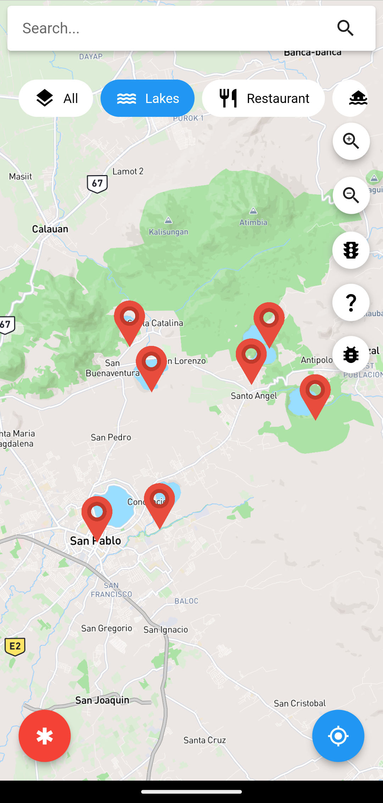
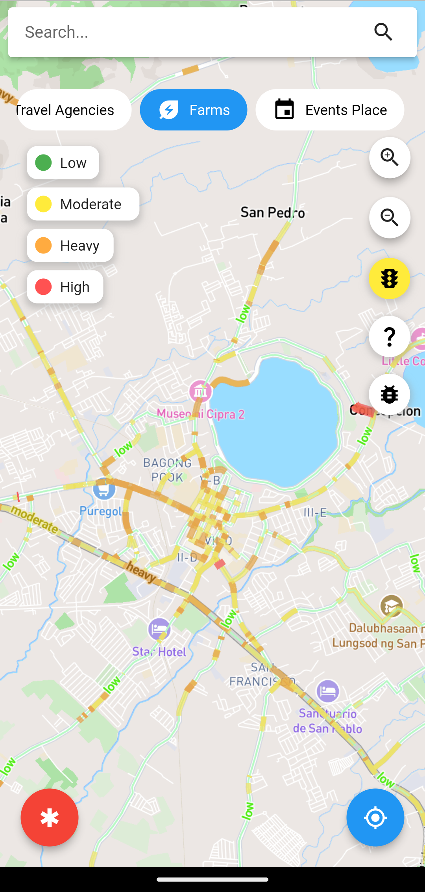
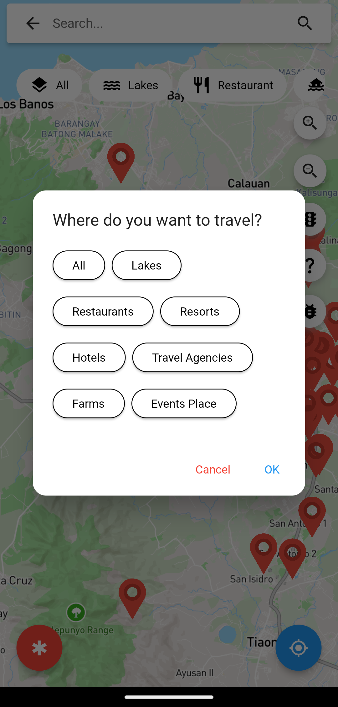
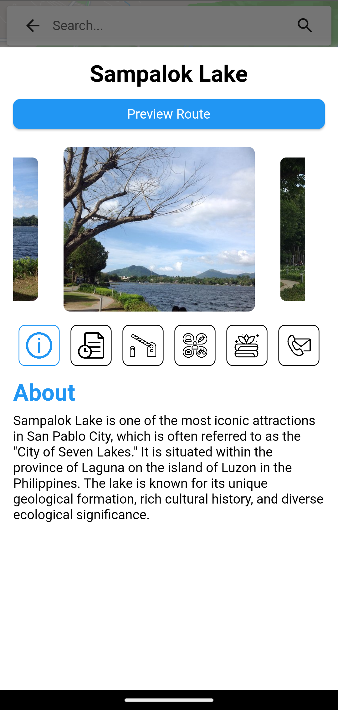

#  Byaheng San Pablo
 A mobile navigation application for tourists who want to travel San Pablo City

## Table of Contents

- [Overview](#overview)
- [Features](#features)
- [Getting Started](#getting-started)
  - [Prerequisites](#prerequisites)
  - [Installation](#installation)
- [Usage](#usage)
- [Contributing](#contributing)
- [License](#license)

## Overview

"Byaheng SanPablo" is a comprehensive mobile application developed as a capstone project to enhance the tourism experience in San Pablo City, Laguna. The application focuses on providing users with invaluable information about the city's attractions, services, and real-time traffic conditions to optimize their travel experience.

## Features

### 1. Interactive Point of Interest Maps

Explore a detailed map of San Pablo City highlighting lakes, restaurants, farms, resorts, travel agencies, inns/motels, event venues, and hotels.



### 2. Real-time Traffic Monitoring

Receive insights about traffic conditions and alternative routes to optimize travel within the city.



### 3. Personalized Experience

Customize your exploration by selecting specific locations or categories based on your interests.



### 4. Data Integration

Utilizes GPS, mapping APIs, and real-time data integration for traffic monitoring. Enriched with data from public traffic sources, user-generated content, and information contributed by local businesses.



## Getting Started

### Prerequisites

- Android Studio
- Dart
- Flutter
- Node.js
- npm (Node Package Manager)

### Installation

Provide step-by-step instructions on how to install and configure your project.

1. Clone the repository: `git clone https://github.com/obscuredx/ByahengSanPablo.git`
2. Navigate to the project directory: `cd ByahengSanPablo`
3. Install dependencies: `npm install`

## Usage

### Firebase Configuration

To integrate Firebase with your Android project, follow these steps:

1. **Add Firebase to your Android project:**
   Visit the [Firebase Console](https://console.firebase.google.com/) and create a new project. Follow the setup instructions to add your Android app to the project.

   - For detailed instructions, refer to the official documentation: [Add Firebase to your Android project](https://firebase.google.com/docs/android/setup).

2. **Download `google-services.json`:**
   After adding your app to the Firebase project, download the `google-services.json` file from the Firebase Console.

3. **Place `google-services.json` in your app module:**
   Move the downloaded `google-services.json` file into the `app` module of your Android project.
```   
   /YourProject
   ├── app/
   │ ├── src/
   │ ├── google-services.json
   │ └── ...
   ├── ...
```

   
4. **Update Gradle files:**
In your `app/build.gradle` file, add the following dependencies and the `apply plugin` line at the bottom of the file:

```gradle
// Other dependencies...

implementation 'com.google.firebase:firebase-analytics:22.0.0'
implementation 'com.google.firebase:firebase-auth:22.0.0'
// Add any other Firebase modules your app requires

// ...

apply plugin: 'com.google.gms.google-services'
```

In your project-level build.gradle file, add the Google services classpath:
```
buildscript {
    dependencies {
        // Other dependencies...
        classpath 'com.google.gms:google-services:4.3.9'
    }
}
```
Sync your project with Gradle files.

5. **Initialize Firebase in your app:**
In your Application class or the main activity, initialize Firebase in the onCreate method:
```
// Import necessary packages
import com.google.firebase.FirebaseApp;

public class YourApplication extends Application {

    @Override
    public void onCreate() {
        super.onCreate();

        // Initialize Firebase
        FirebaseApp.initializeApp(this);

        // Other initialization code...
    }
}
```
Build and Run:
After completing these steps, rebuild your project and run your Android app. Firebase should now be integrated into your project.

For more detailed information and options, refer to the [Firebase Android Setup Guide:](https://firebase.google.com/docs/android/setup).

### Android Configuration

#### Mapbox Access Token

Mapbox APIs and vector tiles require a Mapbox account and API access token. Follow these steps to configure the Mapbox access token:

1. Add a new resource file called `mapbox_access_token.xml` at the following path: `<YOUR_FLUTTER_APP_ROOT>/android/app/src/main/res/values/mapbox_access_token.xml`.

2. Inside `mapbox_access_token.xml`, add the following content, replacing `ADD_MAPBOX_ACCESS_TOKEN_HERE` with your actual Mapbox access token. You can obtain an access token from the [Mapbox account page](https://account.mapbox.com/):

    ```xml
    <?xml version="1.0" encoding="utf-8"?>
    <resources xmlns:tools="http://schemas.android.com/tools">
        <string name="mapbox_access_token" translatable="false" tools:ignore="UnusedResources">ADD_MAPBOX_ACCESS_TOKEN_HERE</string>
    </resources>
    ```

#### App Permissions

Add the following permissions to the app-level Android Manifest (`android/app/src/main/AndroidManifest.xml`):

```xml
<manifest>
    ...
    <uses-permission android:name="android.permission.ACCESS_COARSE_LOCATION" />
    <uses-permission android:name="android.permission.ACCESS_FINE_LOCATION" />
    <uses-permission android:name="android.permission.ACCESS_NETWORK_STATE" />
    ...
</manifest>
```

#### MapBox Downloads Token
Add the MapBox Downloads token with the downloads:read scope to your gradle.properties file in the Android folder to enable downloading the MapBox binaries from the repository. To secure this token from getting checked into source control, you can add it to the gradle.properties of your GRADLE_HOME, which is usually at $USER_HOME/.gradle for Mac. Retrieve this token from your MapBox Dashboard. Review the Token Guide for more information about download tokens.

```
MAPBOX_DOWNLOADS_TOKEN=sk.XXXXXXXXXXXXXXX
```

After adding the above, your gradle.properties file may look something like this:

```
org.gradle.jvmargs=-Xmx1536M
android.useAndroidX=true
android.enableJetifier=true
MAPBOX_DOWNLOADS_TOKEN=sk.XXXXXXXXXXXXXXX
```

#### Update MainActivity.kt
Update MainActivity.kt to extend FlutterFragmentActivity instead of FlutterActivity. Otherwise, you may encounter the error: Caused by: java.lang.IllegalStateException: Please ensure that the hosting Context is a valid ViewModelStoreOwner.

```
// import io.flutter.embedding.android.FlutterActivity
import io.flutter.embedding.android.FlutterFragmentActivity

class MainActivity: FlutterFragmentActivity() {
}
```

#### Add Kotlin Platform Dependency
Add the following implementation platform to android/app/build.gradle:

```
implementation platform("org.jetbrains.kotlin:kotlin-bom:1.8.0")
```

These configurations ensure proper setup for Mapbox integration with your Flutter application on Android.

## Contributing

We welcome contributions, feedback, and collaboration to continuously improve and expand the functionalities of Byaheng SanPablo. Please follow the guidelines in [CONTRIBUTING.md](CONTRIBUTING.md).

## License

This project is licensed under the [MIT License](LICENSE.md) - see the [LICENSE.md](LICENSE.md) file for details.
